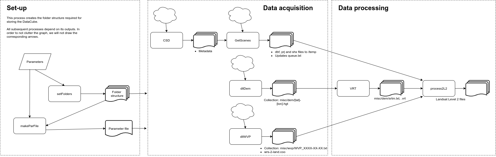

[](https://github.com/RETURN-project/makeDataCube/actions)
[](https://codecov.io/gh/RETURN-project/makeDataCube)
[](https://www.tidyverse.org/lifecycle/)

# makeDataCube
The makeDataCube R project generates a data cube from Landsat data using [FORCE](https://davidfrantz.github.io/code/force/) and allows to generate and add a data mask to the data cube.

You can install it via:

```
library(devtools)
install_github("RETURN-project/makeDataCube")
```

## External dependencies
- [**Python 3**](https://www.python.org/downloads/) should be installed.
  - The [**pylandsat**](https://pypi.org/project/pylandsat/) and [**shapely**](https://pypi.org/project/Shapely/) modules should be available to download data. Both can be installed installed via `pip install pylandsat` and `pip install shapely`.
- In addition, [**FORCE**](https://github.com/davidfrantz/force) (>= 3.6.3) should be installed. **FORCE** allows to generate a data cube of level-2 (or higher) Landsat and Sentinel-2 imagery from level-1 inputs. Please visit the [project's website](https://github.com/davidfrantz/force) for more information and download instructions.
  - If the user wants to use parallelization of Level 1 download (by default this is deactivated), [this](https://github.com/davidfrantz/force/commit/b5685c9b7258d91bcf3a096eee31b7a349f994e6) (or an older) version of **FORCE** is required. More information [here](https://github.com/davidfrantz/force/pull/66#issuecomment-804881143).
- The user should have a **NASA Earthdata account** to download DEM data. The _Login_, _Username_ and _Password_ are stored in a _netrc_ file in the home directory. If no _netrc_ file is found, you will be asked to provide your _Username_ and _Password_ and a _netrc_ file will automatically be created (and stored for a next session). If you don't have an account yet, you can create one [here](https://urs.earthdata.nasa.gov).
- Finally, you need authentication to download data from the LAADS DAAC (WVP data). To that end, you need an create a _.laads_ file is in your home directory with a an **App Key**. The **App Key** can be requested from [NASA Earthdata](https://ladsweb.modaps.eosdis.nasa.gov/tools-and-services/data-download-scripts/#requesting). This key should be stored in a file _.laads_ in your home directory.

## Containers

A containerized installation of this package is available on [Singularity Container Services](https://cloud.sylabs.io/library/_container/60fa8041ff2db5ba27b5b613).

```sh
singularity pull --arch amd64 library://pabrod/default/makedatacube:minimal
```

If you prefer to generate it from a definition file, the file is available on `/inst/singularity`.

## Visual workflow


## Launch in Spider

For launching the analysis in Spider follow the next steps:

1. Navigate to your personal space.
2. Clone this project `git clone https://github.com/RETURN-project/makeDataCube.git`.
3. Get inside the cloned directory: `cd makeDataCube`.
4. Edit `inputs.csv` with your desired inputs.
5. If desired, the processing parameter can be adjusted in the vignette `make_Landsat_cube.Rmd`. More information about these parameters can be found in the documentation and tutorials of [FORCE](https://davidfrantz.github.io/code/force/).
6. Run `sbatch --array=2-3 -N1 ./main.sh inputs.csv` (note that `--array=2-3` processes the lines 2 and 3 of `inputs.csv`).
7. The outputs will be transferred to `OUTPUTD="/home/${USER}/outputs"`. Do you want to change this? Edit it in `run.sh`.

Tip: don't forget to set `eval=TRUE` in line 17 of the vignette.

### Key files

- `inputs.csv` contains the data ranges to be processed. Each line would be send to a node.
- `run.sh` takes care of the fine details.
- `main.sh` calls `run.sh` in a loop, once per line in `inputs.csv`.


