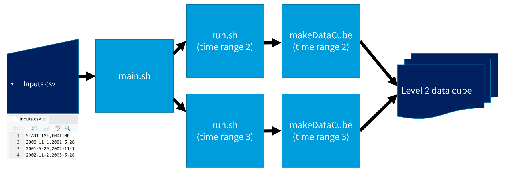

[](https://github.com/RETURN-project/makeDataCube/actions)
[](https://codecov.io/gh/RETURN-project/makeDataCube)
[](https://www.tidyverse.org/lifecycle/)
[](https://doi.org/10.5281/zenodo.5549905)
# makeDataCube
The makeDataCube R project generates a data cube from Landsat data using [FORCE](https://davidfrantz.github.io/code/force/) and allows to generate and add a data mask to the data cube.

You can install it via:

```
library(devtools)
install_github("RETURN-project/makeDataCube")
```

### Installation

#### Install locally

This script requires certain programs to be installed in your computer in order to work. The guide below will help you through this process.

- To download data from Google Cloud, [**gsutil**](https://cloud.google.com/storage/docs/gsutil_install#deb) should be installed.
- [**Python 3**](https://www.python.org/downloads/) should be installed.
  - The [**pylandsat**](https://pypi.org/project/pylandsat/) and [**shapely**](https://pypi.org/project/Shapely/) modules should be available to download data. Both can be installed installed via `pip install pylandsat` and `pip install shapely`.
- In addition, [**FORCE**](https://github.com/davidfrantz/force) (\>= 3.6.3) should be installed. **FORCE** allows to generate a data cube of level-2 (or higher) Landsat and Sentinel-2 imagery from level-1 inputs. Please visit the [project's website](https://github.com/davidfrantz/force) for more information and download instructions.
  - If the user wants to use parallelization of Level 1 download (by default this is deactivated), [this](https://github.com/davidfrantz/force/commit/b5685c9b7258d91bcf3a096eee31b7a349f994e6) (or a newer) version of **FORCE** is required. More information [here](https://github.com/davidfrantz/force/pull/66#issuecomment-804881143).
- Other system requirements are **libpoppler-cpp-dev**, **libgdal-dev** and **libudunits2-dev**. All of them can be installed via `sudo apt-get install <library name>`.

#### Install using a Docker image

We made available [a Docker image](https://hub.docker.com/r/returnproject/makedatacube) with all the requirements pre-installed.
Please run

`docker pull returnproject/makedatacube:v01`

to obtain it and add it to your docker images. After installing, you can use it, for example, like this:

```
docker run -t returnproject/makedatacube:v01 \
Rscript -e "rmarkdown::render('vignettes/make_Landsat_cube.Rmd', params = list(starttime = '2000-11-1', endtime = '2001-5-28’))”
```

The corresponding `Dockerfile` is also available in [`inst/docker/Dockerfile`](/inst/docker/Dockerfile).

#### Install using a Singularity image

If you are more comfortable with Singularity, we pushed [an image](https://cloud.sylabs.io/library/returnproject/default/makedatacube) to Singularity Cloud Services. You can use:

`singularity pull --arch amd64 library://returnproject/default/makedatacube:v1 `

to obtain it. It will download a file with a name like `makeDataCube_v01.sif`. After installing, you can use it, for example, like this:

```
singularity exec makeDataCube_v01.sif \
Rscript -e "rmarkdown::render('vignettes/make_Landsat_cube.Rmd', params = list(starttime = '2000-11-1', endtime = '2001-5-28’))”
```

The corresponding `.def` file is available in [`inst/singularity/full.def`](/inst/singularity/full.def).

### Credentials

This script connects to different data sources. Some of them require credentials, typically a username and a password. Please follow this guide to get yours:

- [**gsutil**](https://cloud.google.com/storage/docs/gsutil_install#deb) should be authorized. This can be achieved by running `gsutil config` and following the instructions. The result of the activation is a `.boto` file.
- The user should have a **NASA Earthdata account** to download DEM data. The *Login*, *Username* and *Password* are stored in a *netrc* file in the home directory. If no *netrc* file is found, you will be asked to provide your *Username* and *Password* and a *netrc* file will automatically be created (and stored for a next session). If you don't have an account yet, you can create one [here](https://urs.earthdata.nasa.gov). Afterwards, you can easily create the `.netrc` file by executing `makeDataCube::EartDataLogin()` in your R console and following the instructions.
- Finally, you need authentication to download data from the LAADS DAAC (WVP data). To that end, you need an create a *.laads* file is in your home directory with a an **App Key**. The **App Key** can be requested from [NASA Earthdata](https://ladsweb.modaps.eosdis.nasa.gov/tools-and-services/data-download-scripts/#requesting). This key should be stored in a file *.laads* in your home directory.
### Other

A presentation about this project was given at Wageningen University on Nov 8th 2021. The slides are temporarily available [here](https://www.dropbox.com/s/ipzdn82uq0dm7mr/makeDataCube.pptx?dl=1).

## Visual workflow


## Problems?
If you experience any problem, please take a look at our [troubleshooting section](/inst/docs/troubleshooting.md).
## Launch in Spider

For launching the analysis in Spider follow the next steps:

1. Navigate to your personal space.
2. Clone this project `git clone https://github.com/RETURN-project/makeDataCube.git`.
3. Get inside the cloned directory: `cd makeDataCube`.
4. Edit `inputs.csv` with your desired inputs.
5. If desired, the processing parameter can be adjusted in the vignette `make_Landsat_cube.Rmd`. More information about these parameters can be found in the documentation and tutorials of [FORCE](https://davidfrantz.github.io/code/force/).
6. Run `sbatch --array=2-3 -N1 ./main.sh inputs.csv` (note that `--array=2-3` processes the lines 2 and 3 of `inputs.csv`).
7. The outputs will be transferred to `OUTPUTD="/home/${USER}/outputs"`. Do you want to change this? Edit it in `run.sh`.

### Key files

- `inputs.csv` contains the data ranges to be processed. Each line would be send to a node.
- `run.sh` takes care of the fine details.
- `main.sh` calls `run.sh` in a loop, once per line in `inputs.csv`.

### Visual overview

When running on Spider, the workflow is slightly modified:


